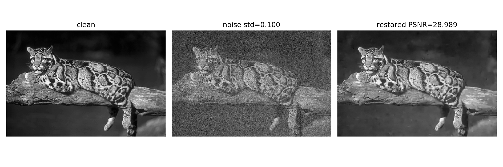
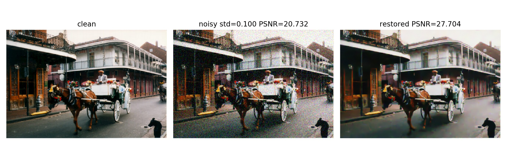

### PyTorch implementation of Expected Patch Log Likelihood (EPLL) image prior

#### 1. Paper:

The EPLL image prior model is presented in ["D. Zoran and Y. Weiss, "From learning models of natural image patches to whole image restoration," 2011 International Conference on Computer Vision, Barcelona, 2011, pp. 479-486, doi: 10.1109/ICCV.2011.6126278."](https://people.csail.mit.edu/danielzoran/EPLLICCVCameraReady.pdf)

#### 2. Acknowledgement:
This code is based on the original [Matlab implementation](http://www.cs.huji.ac.il/~daniez/epllcode.zip), authored by [Yair Weiss](https://www.cs.huji.ac.il/~yweiss/). The pre-trained GMM model is also borrowed from the original code.

#### 3. Key features:

- Pure PyTorch implementation
- Support color image
- Support batch mode (input.shape=[B, C, H, W])
- Adjustable stride: `--stride n` (default 4, the stride in the original matlab code is fixed to 1, higher stride will speed up the code and reduce RAM usage)
- Support parallel processing: `--parallel True` (default True, requires more RAM)

#### 4. Requirements:

- [torch-scatter](https://github.com/rusty1s/pytorch_scatter), tested with version 2.0.5
- Tested with pytorch 1.6.0 and cuda 10.2 on Ubuntu 18.04

#### 5. Usage:

Denoising a clean grayscale image **160068.jpg** contaminated by gaussian noise of standard deviation **0.1**:

`python epll_demo.py --im_file 160068.jpg --noise_std 0.1`

- Specifying `--stride n` will speed up the code and reduce RAM usage.
- Specifying `--parallel True` will speed up the code but this requires more RAM.
- Specifying `--use_cuda True` will let you use GPU. However, this may consume a lot of GPU RAM.

#### 6. Results:
##### 160068.jpg

##### new.jpg

#### 7. TODO:
- [x] Support color image
- [x] Support batch processing
- [x] Optimize speed
- [x] Support backpropagation
