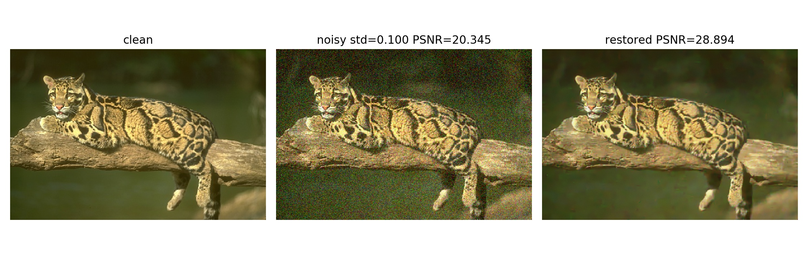

### PyTorch implementation of Expected Patch Log Likelihood (EPLL) image prior

#### 1. Paper:

The EPLL image prior model is presented in ["D. Zoran and Y. Weiss, "From learning models of natural image patches to whole image restoration," 2011 International Conference on Computer Vision, Barcelona, 2011, pp. 479-486, doi: 10.1109/ICCV.2011.6126278."](https://people.csail.mit.edu/danielzoran/EPLLICCVCameraReady.pdf)

#### 2. Acknowledgement:
This code is based on the original [Matlab implementation](http://www.cs.huji.ac.il/~daniez/epllcode.zip), authored by [Yair Weiss](https://www.cs.huji.ac.il/~yweiss/). The pre-trained GMM model is also borrowed from the original code.

#### 3. Requirements:

- `pip install torch-scatter`, tested with version 2.0.5.
- Tested with `pytorch=1.5.0`

#### 4. Usage:

Denoising a clean grayscale image **160068.jpg** contaminated by gaussian noise of standard deviation **0.1**:

`python epll_demo.py -i 160068.jpg -std 0.1`

Specifying `--use_cuda True` will let you use GPU. However, using GPU will only make it 2 times slower.

#### 5. Results:
##### 160068.jpg

##### new.jpg

#### 6. TODO:
- [x] Support color image
- [ ] Support batch processing
- [ ] Support backpropagation
- [ ] Optimize speed